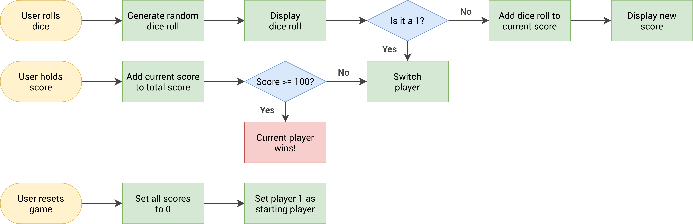

# Pig Game 🎲

A two-player dice game built with vanilla JavaScript as part of my **JavaScript learning journey**.


## How to Play

- Players take turns **rolling the dice**
- Each roll adds to the **current (temporary) score**
- If you roll a **1**, your current score is lost and the turn passes to the other player
- Click **Hold** to save your current score to your total and pass the turn
- First player to reach **100 points wins!** 🏆
- Click **New Game** to reset and play again

## Game Flowchart



## What I Learned

### DOM Selection
| Method | Used For |
|---|---|
| `document.querySelector()` | Selecting elements by class (e.g. `.player--0`, `.dice`) |
| `document.getElementById()` | Selecting elements by ID (e.g. `#score--0`, `#current--1`) |

### DOM Manipulation
| Method / Property | Used For |
|---|---|
| `element.textContent` | Updating score and current score values in the UI |
| `element.src` | Swapping the dice image on every roll |
| `element.classList.add()` | Adding classes like `hidden`, `player--winner` |
| `element.classList.remove()` | Removing classes like `hidden`, `player--active` |
| `element.classList.toggle()` | Switching the `player--active` class between both players |
| `element.classList.contains()` | Checking if the modal is hidden before closing |

### Events
| Method | Used For |
|---|---|
| `addEventListener('click', fn)` | Handling Roll, Hold, and New Game button clicks |

### JavaScript Concepts
- Generating random numbers with `Math.random()` and `Math.trunc()`
- Managing game state with variables (`scores`, `currentScore`, `activePlayer`, `playing`)
- Using an `init` function to set starting conditions and reset the game
- Dynamic element selection with template literals: `` `current--${activePlayer}` ``

## Features

- 2-player local multiplayer
- Live dice image that updates on every roll
- Active player highlight with smooth CSS transitions
- Winner state with a distinct visual style
- Full game reset with one click
- No dependencies — pure HTML, CSS, and JavaScript

## Project Structure

```
├── index.html               # Game markup and layout
├── style.css                # Styling and transitions
├── script.js                # Game logic
├── pig-game-flowchart.png   # Game logic flowchart
├── dice-1.png               # Dice face images
├── dice-2.png
├── dice-3.png
├── dice-4.png
├── dice-5.png
├── dice-6.png
└── .prettierrc              # Code formatter config
```

## Getting Started

1. **Clone the repository**
   ```bash
   git clone https://github.com/Abid584/web-development-journey.git
   cd web-development-journey/Javascript/Pig-Game
   ```

2. **Open in browser**
   ```bash
   open index.html
   ```
   Or just double-click `index.html` — no build step or server required.

## Part of My JavaScript Learning Journey

This project is one of several mini-projects I'm building while learning JavaScript. Check out the rest of the repo to follow along!

## License

This project is open source and available under the [MIT License](LICENSE).
